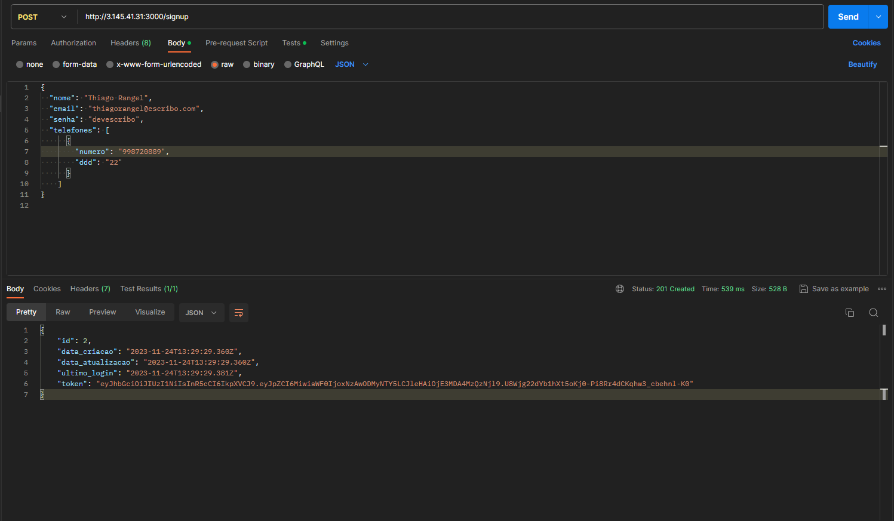
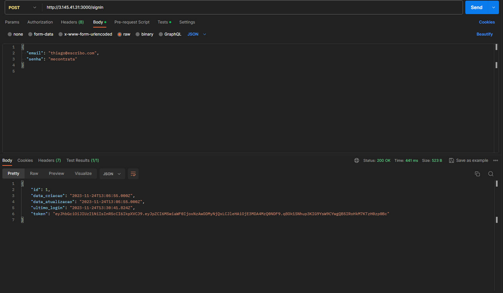
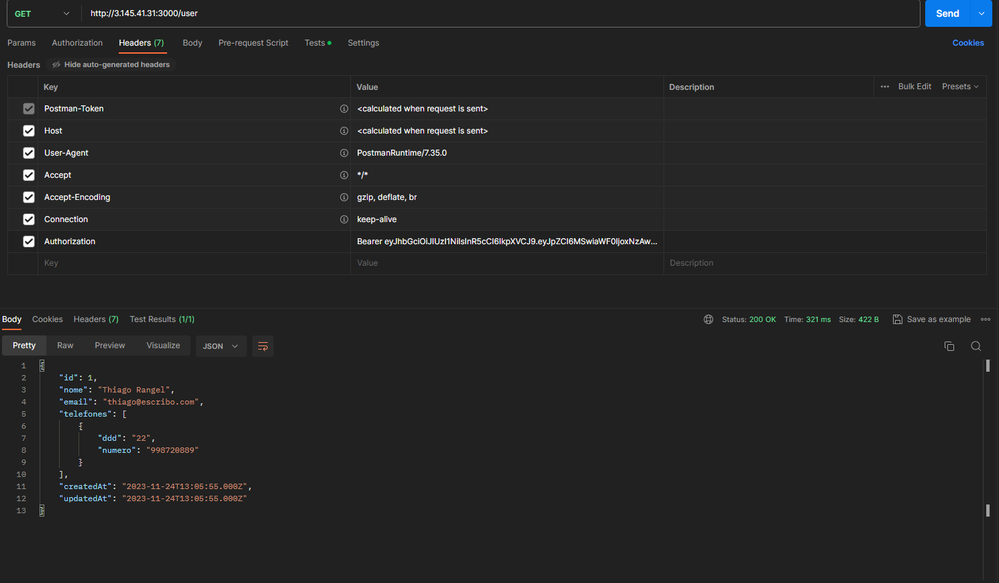

# Desafio Backend Escribo

Objetivo:

Desenvolver uma API RESTful para autenticação de usuários, que permita operações de cadastro (sign up),
autenticação (sign in) e recuperação de informações do usuário.

### Como utilizar a API `Postman`

1 - Cadastrando um novo usuário `POST http://3.145.41.31:3000/signup`

#### Entrada
```bash
{
  "nome": "Thiago Rangel",
  "email": "thiagorangel@escribo.com",
  "senha": "devescribo",
  "telefones": [
      {
        "numero": "998720889",
        "ddd": "22"
      }
    ]
}
```



2 - Realizando Login `POST http://3.145.41.31:3000/signin`

#### Entrada
```bash
{
  "email": "thiago@escribo.com",
  "senha": "mecontrata"
}
```


3 - Buscando usuário pelo token `GET http://3.145.41.31:3000/user`

> Atenção! É necessário copiar o token do login `signin` e adicionar no `Headers`
> Key: `Authorization` Value: `Bearer token`


